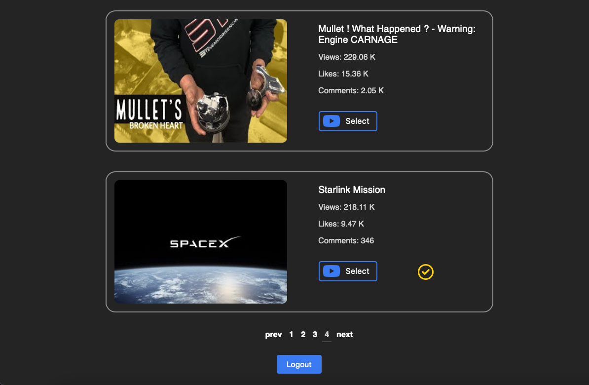

## Shift App

Content optimization tool that allows users to upload and rotate alternate thumbnails based on video engagement. This app is built with React and Node.js, utilizing the google login API and MongoDB.

## Design

The Shift app consists of multiple components that allow you to upload, optimize, and manage your videos:

#### Landing Page:

The landing page allows users to sign in via Google

---

#### Dashboard:

The dashboard component shows you the list of all uploaded videos and their stats and optimization status. You can also use the search bar to find a specific video, as well as the sort feature.

Videos that have been processed will be denoted with the check icon.

#### Upload:

The upload component allows users to upload alternate thumbnails for the selected video.

#### Process:

The process component allows users to initiate optimization. To demonstrate the feature it is currenty set to run every 5 seconds.

### Limitations

As part of the current youtube API users are not able to manipulate content thumbnails via a third party. This project was created for educational purposed only and no feature to push the modified thumbnails to youtube has been implemented. Also in place of displaying the users youtube content the app is currently fetching the 20 most popular videos at the time of development.
